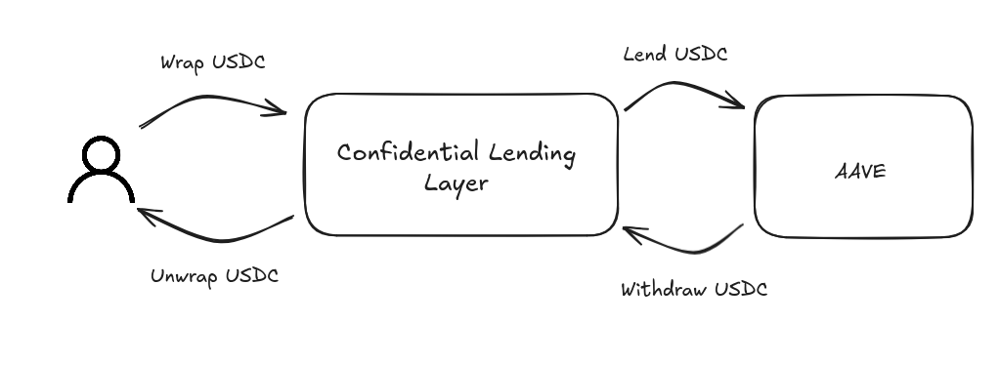

# Confidential layer for lending protocol

This project introduces a confidentiality layer between users and lending protocols such as AAVE. Its purpose is to obfuscate the lending amounts of individual users.

## Overview

Traditionally, when users supply tokens to AAVE, as USDC, they receive aTokens representing their lending positions. However, to preserve privacy, users cannot directly receive aTokens proportional to their supplied amount, as this would reveal their individual balances.

To address this, we introduce a confidentiality layer that enables users to supply liquidity while keeping their balances hidden. User deposits are encrypted and stored privately, and operations are grouped to prevent exposure of individual amounts.

This is achieved by first wrapping the tokens using Zama’s `ConfidentialERC20Wrapped` contract. This contract can wrap any ERC20 token and enables encryption of user balances. Users can unwrap and retrieve their available (i.e., not currently lent) liquidity at any time.

Once balances are hidden, users can choose to provide liquidity to AAVE by submitting encrypted amounts. However, to sent the amount on AAVE, we require to have the plain-text amount. To bridge this gap without compromising privacy, we employ a batching and iteration mechanism.

During each iteration, we are grouping the supply/withdrawal operation from all the users. This is done by computing in a variable the amount of token we need to transfer. A positive amount indicates a supply to AAVE, while a negative one indicates a withdrawal. This operation can be executed once we have reached a predefined timestamp. Notice that different mechanisms could have been used as a threshold parameter of users or even a combination of both.

This iteration mechanism preserves user balance confidentiality by only revealing the aggregated operation across multiple users, without exposing any individual user's action.

The confidential layer is responsible for holding both the original tokens and the aToken representations from AAVE. Lending rewards will continue to be distributed proportionally based on each user's encrypted contribution.

To illustrate how the protocol works, you can take a look at the diagram below. A user begins by wrapping some tokens, such as USDC. By wrapping them, the Confidential layer encrypts and stores the user’s token amount. The user can then choose to provide liquidity to AAVE by creating a transaction, which will be executed in the next iteration. During this iteration, based on user actions, the protocol determines whether it needs to supply or withdraw USDC according to the net operations.

To unwrap the tokens, the user must ensure there are sufficient available funds in the protocol. If there aren’t, the user will first need to request a withdrawal operation to remove liquidity from AAVE, before being able to unwrap the tokens.



## Protocol Limitations

In our current design, we have use a timestamp to wait enough operation. However, it would be maybe more interesting to wait a number of operations and a number of time.

- In a case where all participants want to maximize their yield, if all of them provide liquidity, we can then guess that they provide all the liquidity available, meaning all of their tokens. Currently, we do not have incentive mechanism to reward users by providing only a part of their liquidity to protect other user balance.

- In a scenario where a user wants to provide a large amount of liquidity, it could potentially leak their balance. For example, if one user provides one million USDC while others only contribute a thousand, anyone monitoring the amount sent to AAVE could infer the contributor’s identity based on the transaction size. This risk can be mitigated by ensuring a large number of users contribute to provide liquidity, while broken down the liquidity acros multiple rounds. This approach helps obfuscate individual contributions and prevents leakage of user balances. But to work efficiently, it may required incentivise mechanism.

- One limitation of the current protocol is that we do not handle situations where AAVE lacks sufficient liquidity. If AAVE does not have enough available liquidity, we must wait until enough liquidity is available before proceeding with the transaction.

- At the moment, our protocol can handle only one ERC20 at a time. One improvment could be to integrate a ERC-1155 approach, allowing multiple token representation.

## Highlights

- Leverage existing solution as `ConfidentialERC20Wrapped`
- Working protocol with some tests given the time available.
- Fonctional frontend for wrap/unwrap and lending action.

## Difficulties

- Need more time to think about potential attacks or protocol flow.
- More tests would be appreciated, especially on the reward distribution to check if we did not miss corner cases.
- Would be interesting to have a fork test from AAVE and not mock contracts.

# How to use it

## Smart contract

First, you will need to defined some environment variable in the project.

```bash
cd contracts/
cp .env.example .env
```

To compile the smart contract, you will have to install the dependencies and run the compile command with:

```bash
pnpm install
pnpm compile
```

To test, you can run

```bash
pnpm test
# Or specific test in our case
pnpm test test/confidentialLendingLayer/ConfidentialLendingLayer.ts
```

Finally, to deploy the smart contract on Sepolia, you can run:

```bash
pnpm deploy-sepolia
```

Notice for deployment, we are using the following variable defined in the [AAVE documentation](https://github.com/bgd-labs/aave-address-book/blob/main/src/AaveV3Sepolia.sol).

```typescript
export const AAVE_POOL_ADDRESS = "0x6Ae43d3271ff6888e7Fc43Fd7321a503ff738951";
export const USDC = "0x94a9D9AC8a22534E3FaCa9F4e7F2E2cf85d5E4C8";
export const aUSDC = "0x16dA4541aD1807f4443d92D26044C1147406EB80";
```

## Frontend

On the frontend side, you will have to defined some variables.

```bash
cd front
cp .env.example .env
```

You will have to install the dependencies with:

```bash
pnpm install
```

Then, you can run it locally by using

```bash
pnpm dev
```

## Deployed contract

Deployed `ConfidentialLendingLayer` contract at `0x2446c51E4c4B71bA2897a612d640e6EB57061568`.

> For testing, you can request USDC from AAVE faucet on sepolia.
